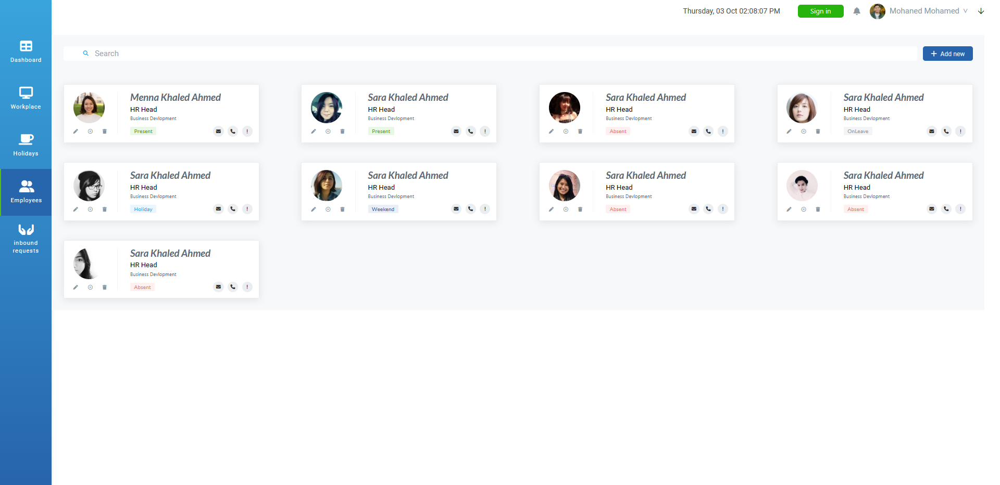
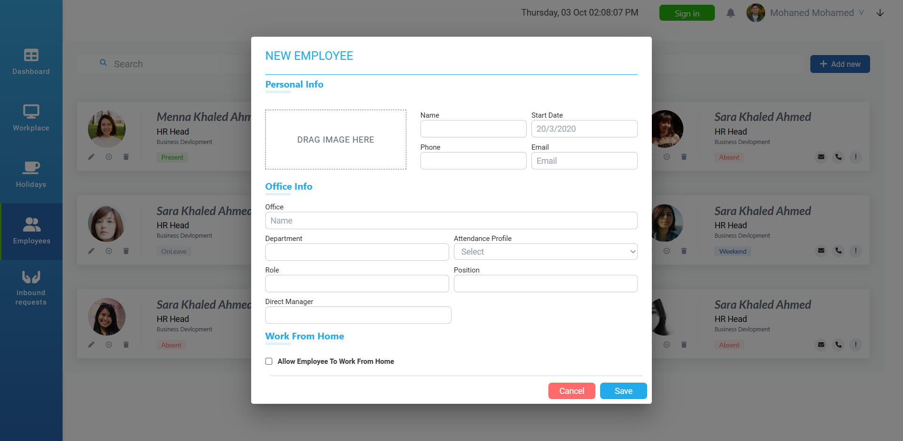

<br />
<div align="center">
  <h1 align="center">Employees App</h1>
  <a href="https://employees-app-flame.vercel.app">Demo</a>
</div>

<details>
  <summary>Table of Contents</summary>
  <ol>
    <li>
      <a href="#about-the-project">About The Project</a>
      <ul>
        <li><a href="#Technologies">Technologies</a></li>
      </ul>
    </li>
    <li>
      <a href="#getting-started">Getting Started</a>
      <ul>
        <li><a href="#prerequisites">Prerequisites</a></li>
        <li><a href="#installation">Installation</a></li>
      </ul>
    </li>
    <li><a href="#Clint-Side">Usage</a></li>
    <li><a href="#contact">Contact</a></li>
  </ol>
</details>

<!-- ABOUT THE PROJECT -->

## About The Project



Employees Dashboard where you add new Employe and check the status of them
made by React , TailwindCss , MUI

### Technologies

Here is what you need to run this app .

- [![Node.js][Node.com]](Node-url)
- [![React][React.js]][React-url]

<!-- GETTING STARTED -->

## Getting Started

Follow next steps to know how to run the App ☺.

### Prerequisites

- [Node](https://nodejs.org/en)

### Installation

1. Clone the repo or you can download it

   ```sh
   git clone https://github.com/MohanedMohamedKhalil/Employees-App
   ```

2. then open terminal or cmd .

   ```js
    npm install
   npm run dev;
   ```

List of Packages for development .

```sh


// frontend

React
React-dom
Redux/Toolkit
Tailwind
Mui
```

<!-- USAGE EXAMPLES -->

## Clint-Side

after all installations app will be run at http://localhost:5173

- Home Page
  

- Add Employee
  

<!-- ROADMAP -->

<!-- CONTACT -->

## Contact

mohanedmohamed41@gmail.com - [LinkendIn](https://www.linkedin.com/in/mohaned-mohamed-khalil/)

<!-- Icons -->

[React.js]: https://img.shields.io/badge/React-20232A?style=for-the-badge&logo=react&logoColor=61DAFB
[React-url]: https://reactjs.org/
[Node.com]: https://img.shields.io/badge/Node.js-18.x-green?style=for-the-badge&logo=node.js&logoColor=white
[Node-url]: https://nodejs.org/
